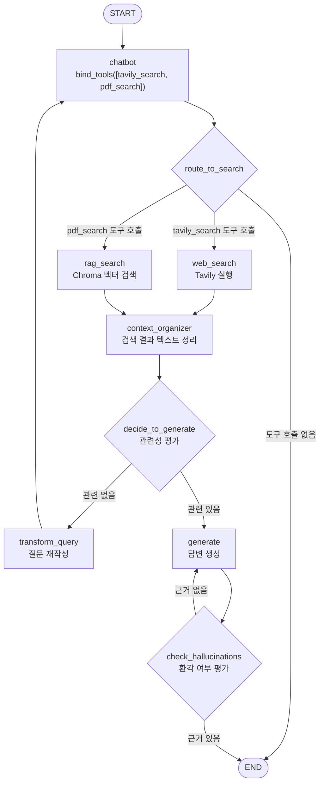

# RAG + 웹검색 조건부 엣지 통합

## 개요

기존 Tavily 웹검색 에이전트에 RAG(Retrieval-Augmented Generation) 파이프라인을 통합한 챕터입니다.
LLM이 질문을 보고 `tavily_search`(웹검색) vs `pdf_search`(문서검색) 도구를 자동으로 선택하며,
두 경로 모두 동일한 품질 검증 파이프라인을 통과합니다.

참조 코드: `D:\Code305\hanbit-aiagent\CHAP6_single-agent\rag_agent`

---

## 그래프 흐름



---

## 노드 상세

### chatbot
- `llm.bind_tools([tavily_search, pdf_search])`로 LLM에 두 도구를 바인딩
- 입력 메시지가 없으면 `HumanMessage(state.question)`으로 초기화
- LLM이 질문 내용에 따라 어떤 도구를 호출할지 자동 결정
- tool_calls가 없으면 직접 `END`로 종료

### web_search
- `messages[-1].tool_calls[0].args["query"]`에서 검색어 추출
- Tavily API 호출 후 결과를 `context` 문자열로 변환
- `ToolMessage`를 messages에 추가

### rag_search
- `messages[-1].tool_calls[0].args["query"]`에서 검색어 추출
- Chroma 벡터 DB에서 k=3 유사 문서 검색
- `"Page {n}: {content}\n"` 포맷으로 `context` 구성
- `ToolMessage`를 messages에 추가

### context_organizer
- LLM을 사용하여 검색 결과의 불필요한 공백·포맷 정리
- 페이지 번호 정보 보존
- 정리된 텍스트를 `context` 필드에 저장

### transform_query
- LLM이 원래 질문을 벡터 검색에 최적화된 형태로 재작성
- `retry_num += 1` (최대 3회 후 fallback)
- `HumanMessage(rewritten_question)`을 messages에 추가 → chatbot 재진입 시 새 질문으로 처리

### generate
- `retry_num < 3`: 일반 답변 생성 (출처 페이지 번호 포함)
- `retry_num >= 3`: fallback — 검색 결과 내에서 답할 수 있는 다른 질문 제안

### check_hallucinations
- LLM이 생성된 답변이 context 문서에 근거하는지 평가
- 근거 있음 → `END`
- 근거 없음 → `generate` 재실행

---

## 조건부 엣지 상세

### route_to_search
```
state.messages[-1].tool_calls[0]["name"]
  "tavily_search" → "web_search"
  "pdf_search"    → "rag_search"
  tool_calls 없음 → END
```

### decide_to_generate
```
retry_num >= 3      → "generate" (강제)
관련성 평가 "yes"   → "generate"
관련성 평가 "no"    → "transform_query"
```

### check_hallucinations
```
답변이 context에 근거함 → END (support)
근거하지 않음           → "generate" (not supported)
```

---

## 파일 변경 내역

| 파일 | 변경 유형 | 주요 내용 |
|------|-----------|-----------|
| [state.py](../../state.py) | 수정 | `messages`, `context`, `retry_num` 필드 추가 |
| [chatbot.py](../../chatbot.py) | 교체 | `bind_tools` 기반 팩토리로 재작성 |
| [graph.py](../../graph.py) | 수정 | `build_rag_agent_graph()` 호출로 교체 |
| [.env.example](../../.env.example) | 수정 | `CHROMA_DB_PATH`, `CHROMA_COLLECTION_NAME` 추가 |
| `agent_graph/features/rag/__init__.py` | 신규 | 패키지 초기화 |
| `agent_graph/features/rag/retriever.py` | 신규 | Chroma retriever 팩토리 함수 |
| `agent_graph/features/rag/nodes.py` | 신규 | 5개 노드 함수 |
| `agent_graph/features/rag/edges.py` | 신규 | 3개 라우팅 함수 |
| `agent_graph/features/rag/graph.py` | 신규 | RAG 그래프 빌더 |

`agent_graph/core/` 하위 파일은 **변경 없음** (stable interface 유지 원칙).

---

## State 스키마 변경

```python
# 추가된 필드
messages: Annotated[list, add] = Field(default_factory=list)  # LangChain 메시지 체인
context: str = ""                                              # 검색 결과 텍스트
retry_num: int = 0                                             # 재시도 횟수 (최대 3)

# 기존 필드 유지 (하위 호환)
tool_calls: list[dict[str, Any]]
tool_results: Annotated[list[dict[str, Any]], add]
message: Annotated[list[str], add]
```

---

## 환경 변수

| 변수 | 필수 | 설명 |
|------|------|------|
| `OPENAI_API_KEY` | ✅ | OpenAI API 키 |
| `TAVILY_API_KEY` | ✅ | Tavily 검색 API 키 |
| `CHROMA_DB_PATH` | ✅ | Chroma 벡터 DB 경로 (예: `./rag_agent/chroma_db`) |
| `CHROMA_COLLECTION_NAME` | ✅ | Chroma 컬렉션 이름 (예: `korean_pdf`) |

---

## 미구현 (추후 목표)

- 단기/장기 메모리 통합
- 웹검색 결과 문서화 및 인덱싱
- 후속 질문에 대한 캐싱 가속

---

## 실행 예시

```bash
# 문서 검색 경로 (한글 맞춤법 PDF)
python graph.py "구개음화가 뭐야?"

# 웹검색 경로
python graph.py "최신 LangGraph 특징 알려줘"
```
